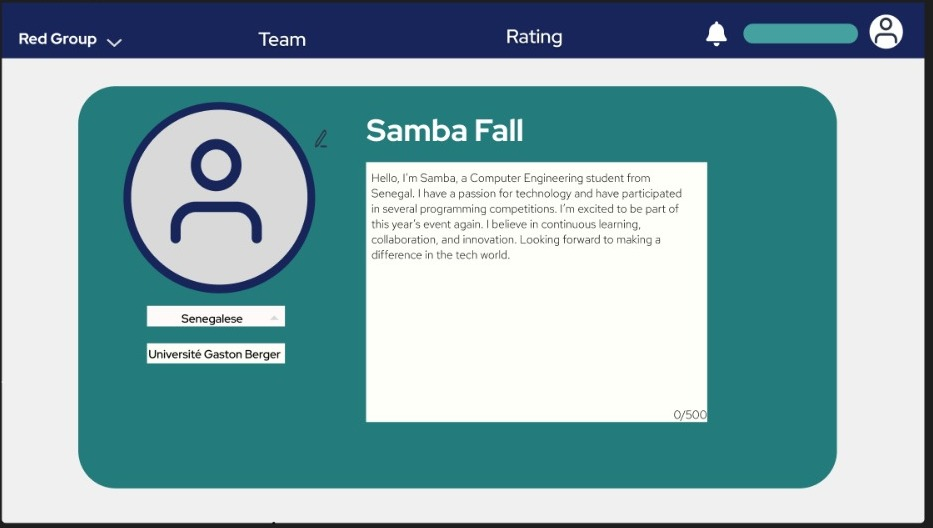
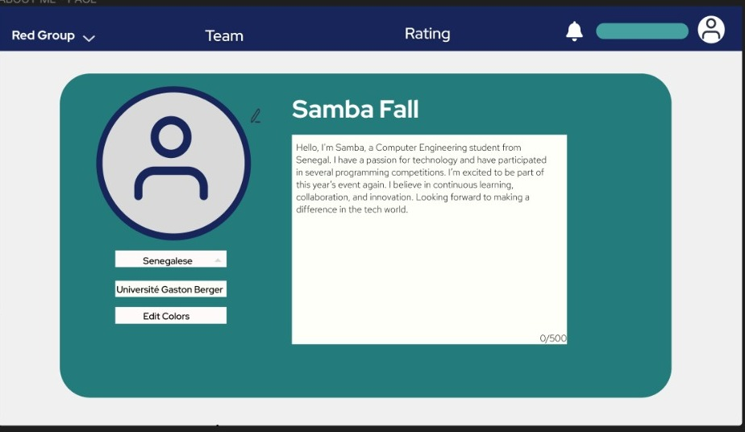

TELA ATUAL
 
 

 
 
Fonte: Material produzido pelo autor (2024)

BREVE DESCRIÇÃO DA PÁGINA:

A tela de perfil foi projetada de forma simples, uma vez que atualmente não dispomos de muitas funcionalidades disponíveis. Nosso objetivo foi minimizar ao máximo a sensação de 'espaço vazio' na interface, e acredito que conseguimos alcançar esse objetivo com sucesso.

Nesta tela, oferecemos opções para edição de perfil, proporcionando aos usuários a capacidade de personalizar suas informações de forma prática e intuitiva. Quando o usuário clica na opção de editar perfil, ele pode facilmente atualizar sua foto de perfil, selecionar seu país de origem e adicionar ou modificar sua biografia.

Nosso foco é garantir que, mesmo com um design simples, a experiência do usuário seja satisfatória e eficiente, permitindo uma personalização rápida e sem complicações. A simplicidade da tela não compromete a funcionalidade, mas sim destaca as opções essenciais de personalização que oferecemos.

Desafios:

Pessoas com daltonismo podem ter dificuldade em distinguir cores, o que pode afetar a usabilidade da interface.
Cores contrastantes podem ser difíceis de ler para quem tem daltonismo, especialmente se forem muito próximas ou se a luminosidade da tela estiver baixa.
O uso de ícones coloridos para representar funções pode ser confuso para quem não consegue distinguir as cores corretamente.
Soluções:

Contraste de cores: É importante garantir que haja contraste suficiente entre as cores da interface, para que sejam facilmente distinguíveis por pessoas com daltonismo.
Opções de cores: Permitir que os usuários personalizem as cores da interface, escolhendo combinações que sejam mais confortáveis para sua visão.
Ícones e símbolos: Utilizar ícones e símbolos claros e facilmente identificáveis, além de texto explicativo para cada função.
Testes de acessibilidade: Realizar testes de usabilidade com pessoas daltônicas para identificar e corrigir problemas de acessibilidade.
Proposta:

Proposta: implementar um botão para editar as cores para mais confortaveis que desejar

Função: Ao clicar no botão, o usuário teria acesso a uma paleta de cores para personalizar o fundo da tela, cores dos botões e outros elementos da interface.
Benefícios:
Maior acessibilidade para pessoas com daltonismo, permitindo que escolham cores que sejam mais confortáveis para sua visão.
Maior personalização da interface, permitindo que cada usuário ajuste as cores de acordo com suas preferências.
Melhoria na experiência do usuário de forma geral, tornando a plataforma mais inclusiva e acessível.
Considerações finais:

Ilustração:

TELA ILUSTRAÇÃO
 
 

 
 
Fonte: Material produzido pelo autor (2024)

